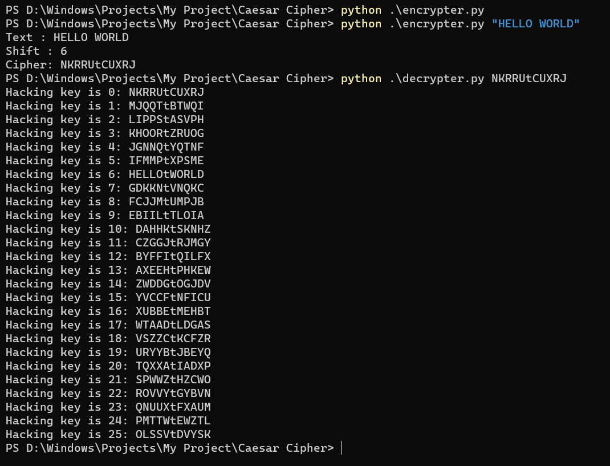

## Introduction
Hello this is a small program to encrypt a string using the ceaser cipher algorithm. This repo also includes a 
program to hack the ceaser cipher using the brute forcing method.

Usage:
```
#to encrypt a string
$ python encrypter.py string-to_encrypt
#to decrypt a string
$ python bruteforcer.py string-to-decrypt
```

Screenshot for output

